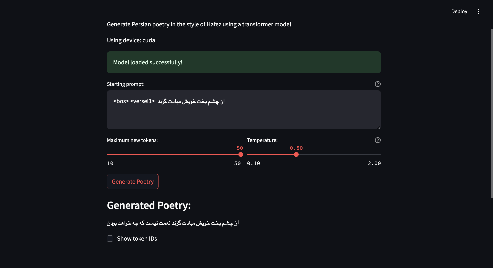

# Persian Poetry Generator: Transformer from Scratch

A Persian poetry generation model built using a transformer architecture implemented from scratch in PyTorch. This model generates poetry in the style of Hafez, a renowned 14th-century Persian poet.



## Features

- **Custom Transformer Architecture**: Built from scratch without using pre-built transformer modules
- **Persian Poetry Generation**: Generates text in the style of Hafez's poetry
- **BPE Tokenization**: Uses byte-pair encoding for efficient tokenization of Persian text
- **Special Poetry Tokens**: Structured output with special tokens for verses and line breaks
- **Interactive Web UI**: Streamlit interface for easy interaction with the model
- **Temperature Control**: Adjust randomness of generation for more diverse or deterministic outputs

## Special Tokens

The model uses special tokens to structure the generated poetry:

- `<versel1>`: Marks the beginning of the first verse (مصرع اول)
- `<versel2>`: Marks the beginning of the second verse (مصرع دوم)
- `<linebreak>`: Indicates a line break between verses
- `<bos>`: Beginning of sequence token

Example prompt format:
```
<bos> <versel1> از چشم بخت خویش مبادت گزند
```

## Demo

Run the Streamlit app to interact with the model through a user-friendly interface. You can:
- Enter a custom prompt to start your poem
- Adjust the number of tokens to generate
- Control generation temperature
- View generated poetry instantly

## Requirements

- Python 3.8+
- PyTorch 2.0+
- Streamlit 1.31+
- Tokenizers 0.14+

## Installation

1. Clone this repository:
   ```bash
   git clone https://github.com/yourusername/transformer-from-scratch-by-Hafez.git
   cd transformer-from-scratch-by-Hafez
   ```

2. Install the required dependencies:
   ```bash
   pip install -r requirements.txt
   ```

3. Make sure you have the model checkpoint and tokenizer files:
   - `model_checkpoint_final.pt`: The trained model weights
   - `persian_poetry_bpe.json`: The BPE tokenizer vocabulary and configuration

## Usage

### Running the Streamlit App

```bash
streamlit run app.py
```

Then open your browser and navigate to the URL displayed in your terminal (typically http://localhost:8501).

### Using the Model Programmatically

```python
import torch
from tokenizers import Tokenizer
from model import GPTLanguageModel, generate

# Load the tokenizer
tokenizer = Tokenizer.from_file("persian_poetry_bpe.json")

# Set device
device = torch.device("cuda" if torch.cuda.is_available() else "cpu")

# Define model parameters (must match trained model)
vocab_size = tokenizer.get_vocab_size()
embedding_dim = 100
context_len = 50
head_size = 8
num_heads = 8
num_transformer_blocks = 5
dropout = 0.2

# Create model
model = GPTLanguageModel(
    vocab_size=vocab_size,
    embedding_dim=embedding_dim,
    context_len=context_len,
    head_size=head_size,
    num_heads=num_heads,
    num_transformer_blocks=num_transformer_blocks,
    dropout=dropout
)

# Load the trained weights
model.load_state_dict(torch.load("model_checkpoint_final.pt", map_location=device))
model.to(device)
model.eval()

# Generate text
prompt = "<bos> <versel1>  از چشم بخت خویش مبادت گزند"
prompt_ids = tokenizer.encode(prompt).ids
generated = generate(
    model, 
    tokenizer, 
    prompt_ids, 
    max_new_tokens=50, 
    context_len=context_len,
    temperature=0.8, 
    device=device
)

# Print the generated text
print(tokenizer.decode(generated[0].tolist()))
```

## Model Architecture

The model is a decoder-only transformer architecture with the following components:

- **Token Embeddings**: Convert tokens to dense vectors
- **Positional Embeddings**: Encode position information
- **Self-Attention Heads**: Multiple heads enable the model to focus on different aspects of the input
- **Feed-Forward Networks**: Process attention outputs
- **Layer Normalization**: Stabilize training
- **Causal Masking**: Ensure the model only attends to previous tokens

Model hyperparameters:
- Vocabulary Size: Based on BPE tokenizer (~50,000 tokens)
- Embedding Dimension: 100
- Context Length: 50 tokens
- Head Size: 8
- Number of Attention Heads: 8
- Number of Transformer Blocks: 5
- Dropout Rate: 0.2

## Training

The model was trained on a corpus of Hafez's poetry using causal language modeling (predicting the next token given previous tokens). During training, the model learned to mimic the style, vocabulary, and poetic structure of Hafez's work.

## Dataset

The training data consists of poems from Hafez, a celebrated Persian poet known for his lyrical ghazals expressing deep philosophical themes and emotional depth. The dataset has been preprocessed and structured to facilitate training.

## Acknowledgments

- The poetry corpus is based on the works of [Persian Poem Corpus](https://github.com/amnghd/Persian_poems_corpus)
- The implementation is inspired by Andrej Karpathy's [nanoGPT](https://github.com/karpathy/nanoGPT)

## License

This project is available under the MIT License. 